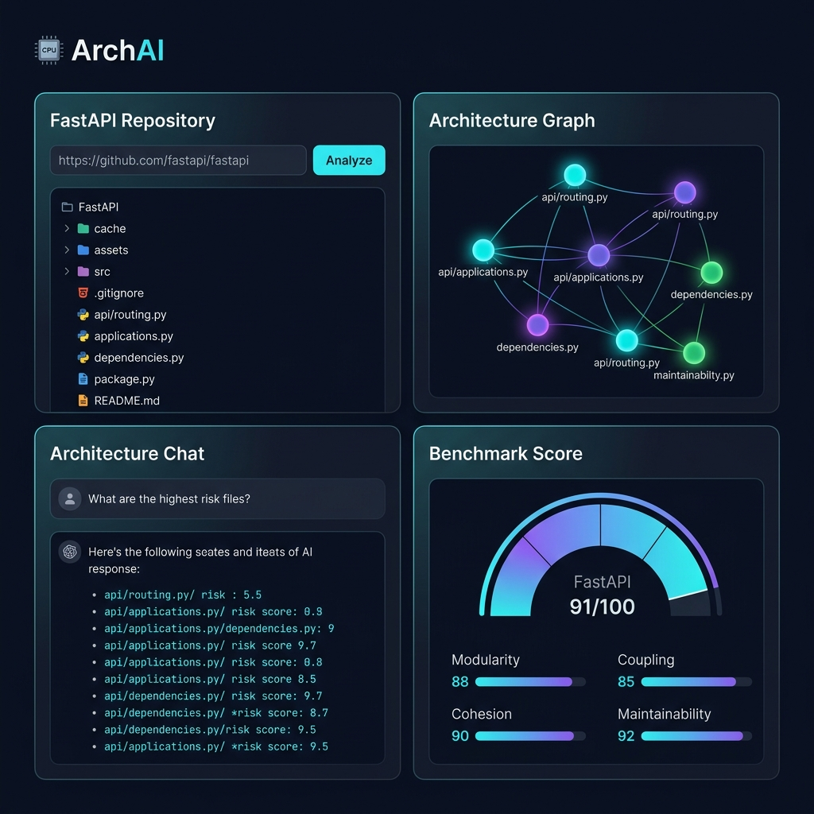

<p align="center">
  
</p>

<h1 align="center">ArchAI</h1>

<p align="center">
  <strong>Turn Any Repository Into Living Architecture</strong>
</p>

<p align="center">
  ArchAI is an AI-powered Software Architect that transforms any GitHub repository into an interactive, queryable architecture map — with intelligent risk detection, refactoring roadmaps, blast-radius analysis, and multi-repo comparison.
</p>

<p align="center">
  <a href="https://github.com/dharmitshah/archai/actions/workflows/ci.yml">
    
  </a>
  <a href="https://github.com/dharmitshah/archai/blob/main/LICENSE">
    
  </a>
  
  
  
  
  <a href="https://github.com/dharmitshah/archai/stargazers">
    
  </a>
</p>

<p align="center">
  <a href="#-features">Features</a> •
  <a href="#-demo">Demo</a> •
  <a href="#-quick-start">Quick Start</a> •
  <a href="#-architecture">Architecture</a> •
  <a href="#-roadmap">Roadmap</a> •
  <a href="#-contributing">Contributing</a>
</p>

---

## ✨ Features

ArchAI goes far beyond simple file tree visualization. It is a full **Architecture Intelligence Engine**.

| Feature | Description |
|---|---|
| 🗺️ **Interactive Dependency Graph** | React Flow–powered visualization of every module, class, and dependency |
| 🧠 **AI Architecture Chat** | Ask natural language questions about any codebase |
| 🏗️ **Layer Detection** | Automatically classifies nodes: API, Service, Model, DB, Queue, Auth, Cache, Worker… |
| ⚡ **Blast Radius Analysis** | See exactly which modules break if you change one file |
| 🔥 **Risk Detection Engine** | Detects circular deps, god modules, dead code, and coupling violations |
| 📊 **Architecture Benchmarks** | Score any repo on complexity, coupling, cohesion, and maintainability |
| 🔄 **Refactoring Roadmap** | AI-generated, prioritized refactoring plan for any codebase |
| 🆚 **Multi-Repo Comparison** | Compare two codebases side-by-side on architecture quality |
| 🕰️ **Architecture History** | Track how your architecture evolves commit-by-commit |
| 📋 **Staff Review Generator** | Export architecture reports in engineering review format |
| 🔬 **Change Simulation** | Simulate refactors before writing a single line of code |

---

## 🎬 Demo

> **Clone a repo. Understand it in 30 seconds.**

```
Analyze → https://github.com/fastapi/fastapi
Ask     → "What are the main architectural layers?"
Ask     → "What are the highest risk files?"
Ask     → "Show me the blast radius of dependencies.py"
```

<p align="center">
  
</p>


---

## 🐳 Docker Quick Start (Easiest)

> **No Python or Node required.** Just Docker and a Gemini API key.

```bash
git clone https://github.com/dharmitshah/archai.git
cd archai
export GEMINI_API_KEY=your_key_here
docker compose up -d
```

Open **[http://localhost:3000](http://localhost:3000)** — done.

---

## 🚀 Quick Start (Manual)

### Prerequisites

| Tool | Version |
|---|---|
| Python | 3.11+ |
| Node.js | 18+ |
| Git | Any |
| Google Gemini API Key | [Get one free](https://aistudio.google.com/app/apikey) |

### 1. Clone the repository

```bash
git clone https://github.com/dharmitshah/archai.git
cd archai
```

### 2. Set up the backend

```bash
cd backend

# Create and activate a virtual environment
python -m venv venv
source venv/bin/activate        # macOS/Linux
venv\Scripts\activate           # Windows

# Install dependencies
pip install -r requirements.txt

# Configure environment
cp ../.env.example .env
# Edit .env and add your GEMINI_API_KEY
```

### 3. Set up the frontend

```bash
cd ../frontend
npm install
```

### 4. Start the application

Open two terminals:

**Terminal 1 — Backend:**
```bash
cd backend
source venv/bin/activate
uvicorn main:app --host 127.0.0.1 --port 8000 --reload
```

**Terminal 2 — Frontend:**
```bash
cd frontend
npm run dev
```

### 5. Open the app

Navigate to **[http://localhost:3000](http://localhost:3000)**, paste any public GitHub URL, and click **Analyze**.

---

## 🏗️ Architecture

ArchAI is built as a modern full-stack application with a clear separation of concerns.

```
archai/
├── backend/                    # FastAPI + Python
│   ├── main.py                 # API routes & endpoints
│   ├── parser.py               # AST-based code analysis engine
│   ├── services/
│   │   └── ai_service.py       # Gemini AI reasoning layer
│   ├── database/               # SQLite schema & migrations
│   ├── tests/                  # Backend test suite
│   └── requirements.txt
│
├── frontend/                   # Next.js 15 + TypeScript
│   ├── app/
│   │   ├── page.tsx            # Landing page
│   │   └── workspace/
│   │       └── page.tsx        # Core workspace (graph, chat, analysis)
│   └── package.json
│
├── docs/                       # Documentation & assets
│   └── assets/
│
├── .github/
│   ├── workflows/              # CI/CD pipelines
│   └── ISSUE_TEMPLATE/         # Bug report & feature request templates
│
├── CONTRIBUTING.md
├── CHANGELOG.md
├── ROADMAP.md
├── SECURITY.md
└── LICENSE
```

### How It Works

```
GitHub URL
    │
    ▼
┌─────────────────────────────────────────────────┐
│  Parser Engine (parser.py)                       │
│  • Git clone                                     │
│  • AST analysis (Python/JS/TS/Go/Java/Rust)     │
│  • Entity extraction (classes, functions, vars)  │
│  • Dependency resolution                         │
│  • Architecture layer classification             │
└───────────────────┬─────────────────────────────┘
                    │
                    ▼
┌─────────────────────────────────────────────────┐
│  AI Reasoning Engine (ai_service.py)            │
│  • Gemini 2.0 Flash integration                 │
│  • Risk scoring & detection                     │
│  • Architecture pattern recognition             │
│  • Natural language Q&A over codebase           │
└───────────────────┬─────────────────────────────┘
                    │
                    ▼
┌─────────────────────────────────────────────────┐
│  Interactive Frontend (workspace/page.tsx)       │
│  • React Flow dependency graph                  │
│  • Architecture chat interface                  │
│  • Benchmarks & comparison dashboards           │
│  • Blast radius & risk heatmaps                 │
└─────────────────────────────────────────────────┘
```

---

## 🔑 Environment Variables

Copy `.env.example` to `backend/.env` and fill in your values:

| Variable | Required | Description |
|---|---|---|
| `GEMINI_API_KEY` | ✅ Yes | Google Gemini API key |
| `DATABASE_URL` | No | SQLite DB path (default: `archai.db`) |
| `CORS_ORIGINS` | No | Allowed origins (default: `http://localhost:3000`) |

---

## 📊 Supported Languages

ArchAI can parse and analyze repositories written in:

| Language | AST Analysis | Import Graph | Layer Detection |
|---|---|---|---|
| Python | ✅ Full | ✅ | ✅ |
| TypeScript | ✅ Full | ✅ | ✅ |
| JavaScript | ✅ Full | ✅ | ✅ |
| Go | ✅ | ✅ | ✅ |
| Java | ✅ | ✅ | ✅ |
| Rust | ✅ | ✅ | 🔄 Beta |
| C/C++ | 🔄 Beta | 🔄 Beta | ➖ |

---

## 🧪 Running Tests

**Backend:**
```bash
cd backend
source venv/bin/activate
python -m pytest tests/ -v
python verify.py
```

**Frontend:**
```bash
cd frontend
npm run build   # Type-check & build validation
```

---

## 🗺️ Roadmap

See [ROADMAP.md](ROADMAP.md) for the full planned feature list.

**Upcoming highlights:**
- [ ] GitHub OAuth — analyze private repositories
- [ ] VS Code Extension — ArchAI inside your editor
- [ ] Real-time collaboration — shared architecture sessions
- [ ] Incremental analysis — live updates as you code
- [ ] Architecture diff — compare any two commits

---

## 📚 Documentation

| Document | Description |
|---|---|
| [API Reference](docs/API.md) | Full REST API documentation |
| [Architecture](docs/ARCHITECTURE.md) | How ArchAI works internally |
| [Self-Hosting](docs/SELF_HOSTING.md) | Deploy on your own server |
| [Design Decisions](DESIGN_DECISIONS.md) | Why we built it this way |
| [Known Limitations](docs/KNOWN_LIMITATIONS.md) | Honest accuracy assessment |
| [FAQ](FAQ.md) | Common questions answered |
| [Troubleshooting](TROUBLESHOOTING.md) | Fix common issues |
| [Pitch Deck](docs/PITCH.md) | For investors and evaluators |

---

## 🤝 Contributing

Contributions are warmly welcome! Please read [CONTRIBUTING.md](CONTRIBUTING.md) for guidelines.

**Quick contribution guide:**
1. Fork the repository
2. Create a feature branch: `git checkout -b feature/your-feature`
3. Make your changes with tests
4. Open a Pull Request

---

## 🔒 Security

Found a vulnerability? Please read [SECURITY.md](SECURITY.md) and report responsibly.

---

## 📄 License

ArchAI is open source under the [MIT License](LICENSE).

---

## 🙏 Acknowledgements

Built with:
- [Google Gemini](https://deepmind.google/technologies/gemini/) — AI reasoning
- [React Flow](https://reactflow.dev/) — Interactive graph visualization
- [FastAPI](https://fastapi.tiangolo.com/) — High-performance Python API
- [Next.js](https://nextjs.org/) — React framework

---

<p align="center">
  Made with ❤️ by <a href="https://github.com/dharmitshah">Dharmit Shah</a>
</p>

<p align="center">
  <a href="https://github.com/dharmitshah/archai">⭐ Star this repo if you find it useful!</a>
</p>
